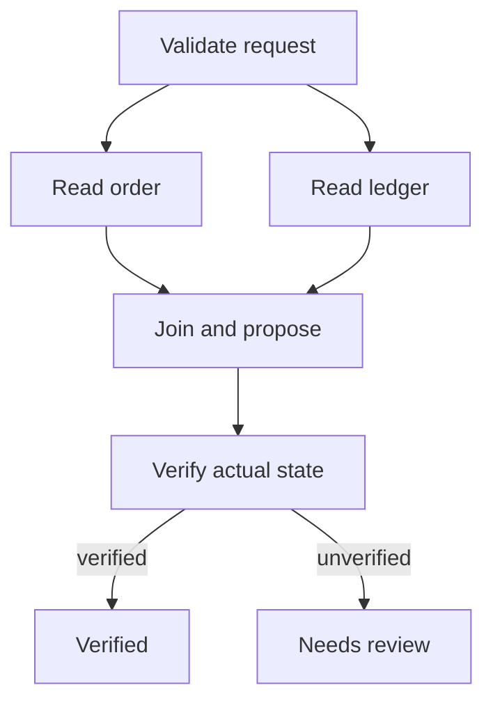

# Week 7 lab: from a plain harness to explicit graph execution

**Status: executed locally on 12 September 2026 with Python 3.12.14 and LangGraph 1.2.11.** The complete source is in `langgraph-example/refund_verification.py`; six deterministic checks are in `langgraph-example/test_example.py`. The dependency snapshot is included. No model inference or real refund service is involved. The persistence and interrupt extension at the end is a design exercise, not an implemented or tested feature of this example.

The goal is to move orchestration into a graph while preserving the separation between a proposal and independently verified completion. We reuse the refund domain from the plain-Python harness: order `order-7`, a full amount of 2,400 cents, an order record, and a refund receipt. This first graph verifies the status of an existing simulated refund. It does not initiate a refund. Moving the mutation and approval stages follows in weeks 9–10.

## What transfers from the earlier harness

| Plain-Python responsibility | Week 7 graph representation | What still belongs to application code |
|---|---|---|
| Harness state dictionary | Typed domain state | Field meaning and invariants |
| Observation gathering | Parallel order and ledger readers | Tool authorization and input validation |
| Policy's final message | `propose` node with a fixed scripted claim | Model adapter, when introduced later |
| Independent completion check | `verify` node reading the service fixture | Definition of successful completion |
| Stop reason | Explicit terminal status | User-facing wording for review or failure |
| Loop control | Edges, join barrier, and conditional routing | Business policy for choosing a route |

`TypedDict` documents types; it does not validate arbitrary input at runtime. The example explicitly rejects an unknown order. A production tool boundary needs complete runtime validation and authorization. A graph does not supply either merely because its state is typed.

## Predict the execution before running it

The `start` node validates the order and schedules two independent readers. Both readers return updates to the same `evidence` channel. The reducer merges records by stable evidence ID. The explicit join waits for both readers before scheduling `propose`. The proposal always claims completion; verification independently determines whether the graph can mark the task verified.



The two reader nodes execute within the same superstep. Each sees the state available before their combined updates are applied. The next node observes the merged evidence. Their wall-clock completion order is not a business ordering guarantee. The test accepts either reader order but requires both to precede the proposal. This follows LangGraph's documented state/reducer and superstep model. [Graph API overview](https://docs.langchain.com/oss/python/langgraph/graph-api)

Write down your predictions for these cases:

| Case | Order fixture | Receipt fixture | Reader evidence | Expected terminal status |
|---|---|---|---|---|
| `verified` | Refunded | Exactly the expected receipt | Both sources | `verified` |
| `false_completion` | Paid | None | Both sources | `needs_review` |
| `missing_evidence` | Refunded | Exactly the expected receipt | Order source only | `needs_review` |

The last case expresses an intentionally conservative course policy: authoritative state must verify the outcome and both required observation sources must be present. An outcome can be true while the workflow's evidence requirement remains unmet. The flag `verified` means that both conditions passed; it is not a universal definition of business truth.

## Set up and run

From the extracted course directory, create an isolated environment. These are POSIX shell commands; Windows users can invoke the corresponding `.venv-langgraph/Scripts/python.exe` path.

```bash
python3.12 -m venv .venv-langgraph
.venv-langgraph/bin/python -m pip install -r \
  langgraph-example/requirements.txt
export LANGSMITH_TRACING=false
export LANGCHAIN_TRACING_V2=false
.venv-langgraph/bin/python langgraph-example/refund_verification.py
.venv-langgraph/bin/python -m unittest discover \
  -s langgraph-example -p 'test_*.py' -v
```

For the full package versions used in the verified environment, install `langgraph-example/requirements-lock.txt` instead. The lock records exact package versions; it is not a cross-platform, hash-verified lockfile. Downloading dependencies requires network access. Executing the example itself requires no API credentials.

Expected observable outcome: three JSON records with the same `final_claim`; their statuses are `verified`, `needs_review`, and `needs_review`. All six tests pass. The tests check graph ordering and application invariants rather than an LLM's phrasing.

## Read the complete source

The runnable source follows. Keep it beside the tests while studying; the file in `langgraph-example` is the canonical executable version.

```python
"""Model-free fan-out/fan-in: a final claim is not proof of a refund."""
from __future__ import annotations

import json
from typing import Annotated, Literal, TypedDict

from langgraph.graph import END, START, StateGraph


class Evidence(TypedDict):
    source: str
    order_id: str
    status: str
    amount_cents: int


def merge_evidence(left: dict[str, Evidence], right: dict[str, Evidence]):
    """Duplicate IDs must agree; conflicts fail closed, never last-writer-wins."""
    merged = dict(left)
    for key, value in right.items():
        if key in merged and merged[key] != value:
            raise ValueError(f"conflicting evidence ID: {key}")
        merged[key] = value
    return merged


class State(TypedDict):
    order_id: str
    evidence: Annotated[dict[str, Evidence], merge_evidence]
    final_claim: str
    verified: bool
    terminal_status: Literal["pending", "verified", "needs_review"]


def build_graph(scenario: str):
    # Trusted fixture stands in for an external service, outside graph state.
    refunded = scenario != "false_completion"
    backend = {
        "order": {"status": "refunded" if refunded else "paid", "paid_cents": 2400},
        "receipts": [{"order_id": "order-7", "amount_cents": 2400}] if refunded else [],
    }

    def start(state: State):
        if state["order_id"] != "order-7":
            raise ValueError("unknown order")
        return {"terminal_status": "pending"}

    def retrieve_order(state: State):
        return {"evidence": {"order-service:order-7": {
            "source": "order-service", "order_id": state["order_id"],
            "status": backend["order"]["status"], "amount_cents": 2400,
        }}}

    def retrieve_ledger(state: State):
        if scenario == "missing_evidence":
            return {"evidence": {}}
        return {"evidence": {"ledger:order-7": {
            "source": "ledger", "order_id": state["order_id"],
            "status": "found" if backend["receipts"] else "missing",
            "amount_cents": 2400 if backend["receipts"] else 0,
        }}}

    def propose(_state: State):
        # Deliberately overconfident policy: identical claim in every case.
        return {"final_claim": "The full refund is complete."}

    def verify(state: State):
        expected = {"order-service:order-7", "ledger:order-7"}
        complete_evidence = set(state["evidence"]) == expected
        # Independent oracle rereads authoritative fixture, not the final claim.
        actual_refund = (
            backend["order"]["status"] == "refunded"
            and backend["receipts"] == [{"order_id": "order-7", "amount_cents": 2400}]
        )
        return {"verified": complete_evidence and actual_refund}

    def route(state: State) -> Literal["complete", "review"]:
        return "complete" if state["verified"] else "review"

    builder = StateGraph(State)
    for name, node in [("start", start), ("order", retrieve_order),
                       ("ledger", retrieve_ledger), ("propose", propose), ("verify", verify)]:
        builder.add_node(name, node)
    builder.add_node("complete", lambda _: {"terminal_status": "verified"})
    builder.add_node("review", lambda _: {"terminal_status": "needs_review"})
    builder.add_edge(START, "start")
    builder.add_edge("start", "order")
    builder.add_edge("start", "ledger")
    builder.add_edge(["order", "ledger"], "propose")  # Explicit barrier: wait for both.
    builder.add_edge("propose", "verify")
    builder.add_conditional_edges("verify", route, {"complete": "complete", "review": "review"})
    builder.add_edge("complete", END)
    builder.add_edge("review", END)
    return builder.compile()


def initial_state() -> State:
    return {"order_id": "order-7", "evidence": {}, "final_claim": "",
            "verified": False, "terminal_status": "pending"}


if __name__ == "__main__":
    for scenario, expected in [("verified", "verified"),
                               ("false_completion", "needs_review"),
                               ("missing_evidence", "needs_review")]:
        result = build_graph(scenario).invoke(initial_state())
        assert result["terminal_status"] == expected, result
        print(json.dumps({"scenario": scenario, **result}, sort_keys=True))
```

## Why these implementation choices matter

**A channel is an update contract.** The `evidence` field names the aggregation point; `merge_evidence` defines what writing to it means. New IDs are added. Repeated identical IDs are harmless. Conflicting records under one ID raise an error. This is an application policy. Another system might explicitly version evidence or collect contradictions instead. Silently overwriting a worker's record would hide disagreement.

**The merge is deliberately independent of reader order.** For nonconflicting IDs, either update order produces the same mapping. Duplicate delivery does not create a second record. A conflicting value is rejected in either order. Dictionary display order is not evidence precedence; sorted JSON is only for readable output. The reducer builds a new mapping and readers treat record values as immutable.

**The join is explicit.** `add_edge(["order", "ledger"], "propose")` declares a dependency on both readers. A pair of arrows in an architecture slide is not an adequate substitute for checking the framework's actual scheduling semantics. The test inspects update events and confirms the barrier behavior.

**A final message is a proposal to finish.** In this deliberately adversarial fixture, the policy says the same confident sentence regardless of the actual refund state. The verifier reads the trusted backend fixture rather than interpreting that sentence. The graph routes only on the verifier's boolean result. Returning a string containing “complete” cannot choose the terminal route.

**Evidence collection and outcome verification have different jobs.** The evidence channel is useful context and an audit artifact. The completion oracle rereads authoritative state. Here the backend is a fixed in-memory fixture; a real service can change between observations, and separate service reads are not an atomic distributed snapshot. Production verification needs an explicit freshness and consistency contract.

**State does not own external authority.** The fixture is captured by trusted code outside the graph state. Later, a model may propose a tool call, but neither its text nor a state field should let it forge a service response, grant an approval, or redefine the verifier. This example demonstrates the separation structurally; it does not implement a complete security boundary.

## Lab work and pass criteria

1. Run the example, then inspect `test_example.py`. Explain why `false_completion` fails even though two evidence records exist. Explain why `missing_evidence` fails even though the fixture says the refund occurred.
2. Stream the graph with `stream_mode="updates"` in a scratch driver. Predict each update before printing it. Show the two reader events in either order and the merged evidence visible at proposal time.
3. Temporarily remove the reducer annotation and run the parallel example. Record the observed error and connect it to simultaneous ownership of a field. Restore the annotation; the submitted baseline must pass.
4. Add a third read-only source with a unique evidence ID. Update the join and required-source policy deliberately. Write one case in which that source returns no usable result. Decide whether the correct result is review, a fallback read, or a bounded retry; justify the business policy.
5. Add duplicate receipt data to a fixture. The expected result is review because a full-refund invariant requires exactly one matching receipt. Preserve the independent oracle instead of accepting a source's “found” label as proof.
6. Replace the scripted proposal with a function parameter that accepts evidence and returns text. Use three deterministic policies: cautious, correct, and falsely confident. Keep outcomes controlled by verification. A real model adapter is optional after these cases pass.

Submit the graph, a predicted-versus-observed execution trace, the dependency versions, and a short invariant table. Passing requires: both readers finish before proposal; reader order cannot change valid evidence; repeated identical records do not multiply evidence; conflicts are explicit; a false final claim cannot produce verified status; and missing required evidence cannot be ignored. Explain each property from the code without relying on framework marketing terms.

## Week 9–10 companion: persistence and approval

The complete runnable implementation is now supplied in `labs/coursekit/graphs.py` and `labs/coursekit/product.py`. Run `python labs/run_lab.py 5` for a real SQLite-checkpointed interrupt, effect commit, injected crash, database reopening, and resume. The conceptual discussion below explains the contract; the complete edition tests the companion separately from this original bridge.

This section specifies the next lab. It has **not** been implemented or tested in the included example. Use the official docs matching your selected backend and record those package versions before implementing it.

First separate graph state from the simulated external service state. Store the service ledger durably and independently. Compile the graph with an appropriate persistent checkpointer and resume using a stable thread identifier. An in-memory checkpointer supports a local continuity demonstration but does not survive process death. Track successful parallel work as well as full checkpoints when reconstructing a failure. [Checkpointers](https://docs.langchain.com/oss/python/langgraph/checkpointers)

Then extend the state machine with a pending mutation intent, approval decision, executor, and verifier. The intent contains an operation ID and a canonical payload for order, amount, and tenant. Approval is bound to that exact payload and a trusted actor. The executor rechecks the binding and authorization before making a mutation. The business operation ID remains stable across attempts; the execution attempt ID changes each time.

Use `interrupt()` only after understanding its replay contract: resumption restarts the node, code before the interrupt can execute again, and positional interrupt matching constrains changes to the node. Do not swallow the runtime's interruption with a broad exception handler. Keep approval payloads serializable. [Interrupts](https://docs.langchain.com/oss/python/langgraph/interrupts)

Draw and implement these recovery cases:

| Failure point | Required evidence after restart | Required behavior |
|---|---|---|
| Before approval | Stored proposal and pending decision | No refund executed |
| After approval, before API request | Exact approved intent | Execute only that authorized intent |
| After remote commit, before response/checkpoint | Operation ID; remote result may be unknown | Query or retry with the same supported idempotency key; reconcile uncertainty |
| After persisted execution result | Receipt and operation identity | Verify completion without creating another refund |
| After proposal edits | New payload digest | Old approval cannot authorize the changed operation |

Checkpointing a completed task can avoid repeating saved work, but an unfinished task can still repeat. A remote commit and a checkpoint are not one transaction. The executor's idempotency and reconciliation contract therefore remains necessary even when the graph has persistence. [Functional API overview](https://docs.langchain.com/oss/python/langgraph/functional-api)

Before shipping the extension, resume representative old checkpoints on candidate code. Preserve pending node identities and compatible state; decide whether existing runs should follow their original business behavior. Record a behavioral version when a thread begins if needed. [Backward compatibility](https://docs.langchain.com/oss/python/langgraph/backward-compatibility)

The completed persistence lab must report exactly which effects are protected under which assumptions. A local mock proving one SQLite transaction does not prove arbitrary remote APIs execute exactly once.
